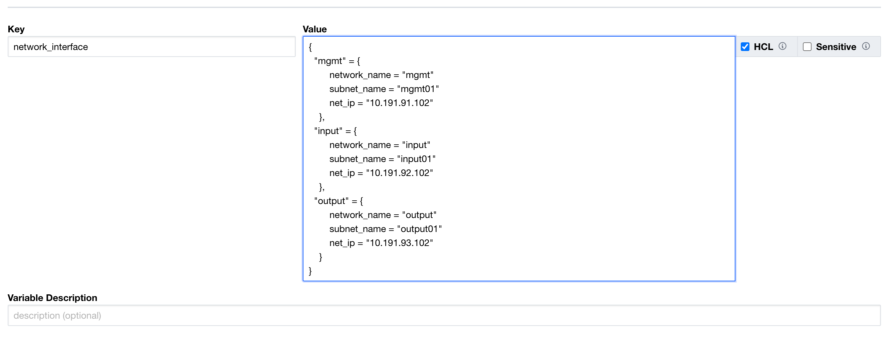
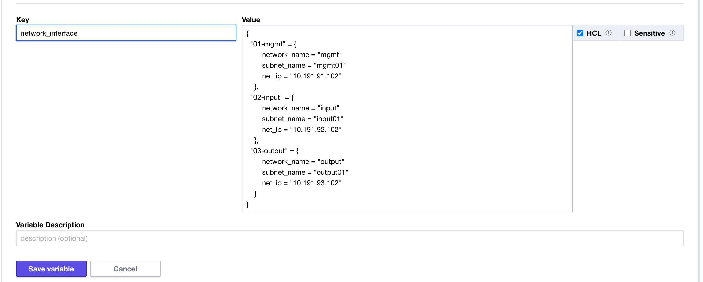
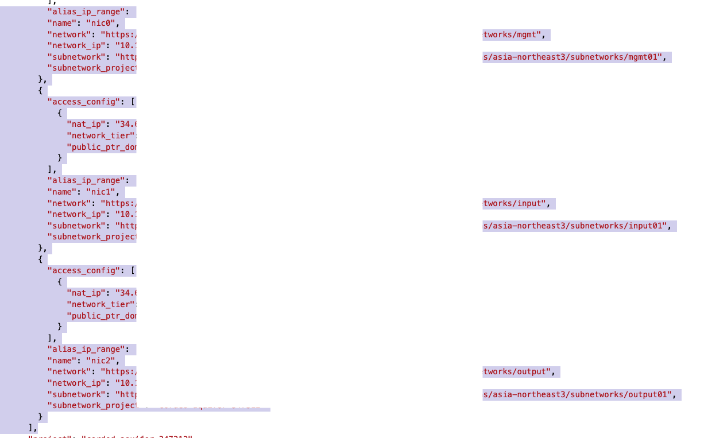

# 2022년 6월 29일


## 오늘의 도움말

* For, for_each를 사용하는 경우 order (순서)를 명시적으로 지정하는 간단한 방법

* 코드 상 개선하는 방안도 추가 예정

   


## 순서가 문제가 되는 상황

- 다음 링크 상의 정보를 참고하여 작업

  - https://www.terraform.io/language/expressions/for

> ## Element Ordering
>
> Because `for` expressions can convert from unordered types (maps, objects, sets) to ordered types (lists, tuples), Terraform must choose an implied ordering for the elements of an unordered collection.
>
> For maps and objects, Terraform sorts the elements by key or attribute name, using lexical sorting.
>
> For sets of strings, Terraform sorts the elements by their value, using lexical sorting.
>
> For sets of other types, Terraform uses an arbitrary ordering that may change in future versions of Terraform. For that reason, we recommend converting the result of such an expression to itself be a set so that it's clear elsewhere in the configuration that the result is unordered. You can use [the `toset` function](https://www.terraform.io/language/functions/toset) to concisely convert a `for` expression result to be of a set type.

위와 같이 for 문을 사용하는 경우, lexical sorting을 적용하여 알파벳 순서에 의해 자원 생성 순서가 결정될 수 있다.

GCP Compute Engine 생성 시 멀티 NIC 생성 사례를 통해 순서 (order)를 지정하는 간단한 방안을 확인해보겠다.


### 1. 순서(order) 적용 전

아래와 같은 코드를 사용하여 멀티 nic를 사용하는 경우, 순서(order)를 고민하지 않고, 자원을 생성하게 되면 사전식 순서(lexical order)에 의해 생성되어, 코드 작성자가 희망하는 것처럼 변수가 선언된 순서로 생성되지 않는다.

```bash
# 코드 생성 main.tf의 일부
...

resource "google_compute_instance" "non_gpu" {
  count        = var.machine_type == "n1-highmem-8" ? 0 : 1
  name         = var.instance_name
  machine_type = var.machine_type
  zone         = var.gcp_zone

  boot_disk {
    initialize_params {
      image = var.instance_image
    }
  }

  dynamic "network_interface" {
   for_each = { for k,v in var.network_interface: k => v }
    content{
    network = network_interface.value["network_name"]
    subnetwork = network_interface.value["subnet_name"]
    network_ip = network_interface.value["net_ip"]

    access_config  {
      //
    }
    }
  }
}
...

# 변수 선언 variables.tf의 일부
variable "network_interface" {
  description = "network type"
  type = map(object({
    network_name = string
    subnet_name  = string
    net_ip       = string
  }
  )
  )
}
```


Terraform Cloud 상 Workspace에 정의된 실제 변수값.



사전식 순서에 의해 NIC가 mgmt --> input --> output 순서로 생성되지 않고, input --> mgmt --> output 순서로 생성됨.


### 2. 순서(order) 적용 후

이를 원하는 순서(order)를 적용하는 간단한 방법은 사전식 순서를 우리가 원하는 형태로 지정하는 방법이 있다.

Terraform Cloud 상 변수값을 아래와 같이 수정하고, 실행하면 우리가 원하는 순서대로 NIC가 생성된다.




위와 같이 설정 후 terraform apply를 적용한 결과는 tfstate파일을 통해 확인할 수 있다.

